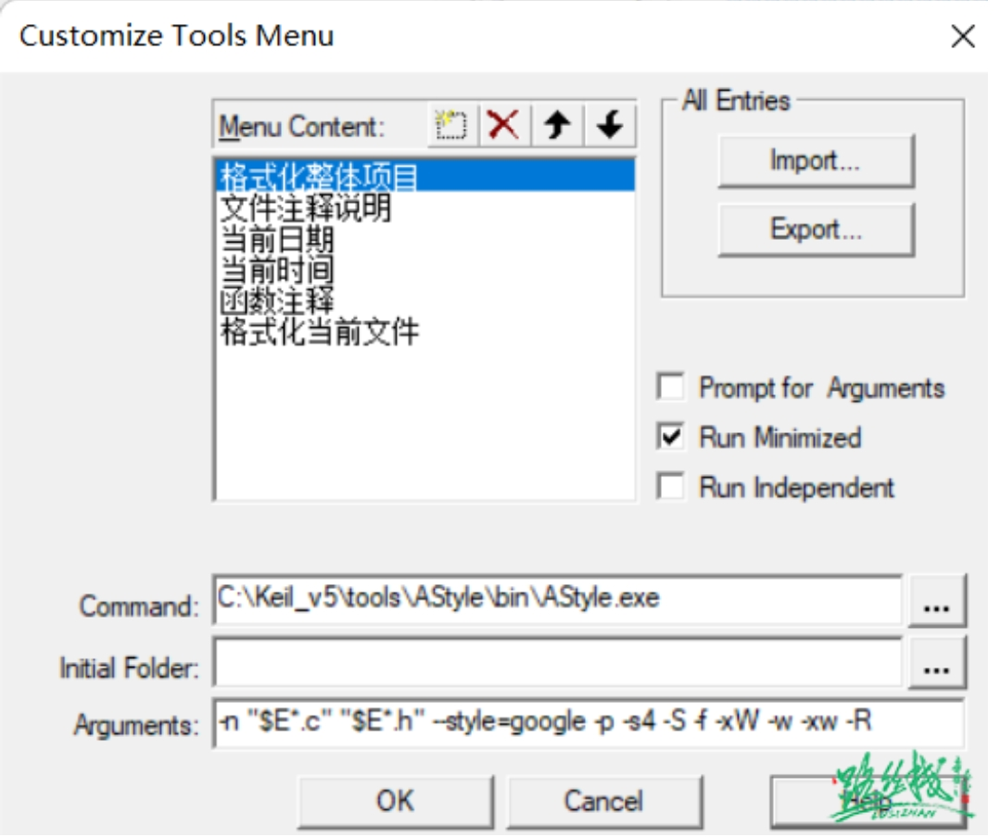

# ARM
Keil插件

本人收集了几个常用的keil插件:

1.AStyle

2.FileComments

3.DateTime

4.FunctionComment

1.AStyle可以对代码进行格式化分别是对**单个**文件格式化，命令：
```shell 
-n !E --style=google -s4
```

对**多个**文件格式化，但需要在同一个文件夹，命令：
```shell
-n "$E*.c" "$E*.h" --style=google -p -s4 -S -f -xW -w -xw -R
```

2.FileComments可以对*.h和*.c进行快速添加**注释**，但需要模版文件，此文件在最下面提供下载，命令：
```shell
!E
```

3.DateTime可以识别当前**日期和时间**，用的不多，命令：
当前日期：
```shell
!E ~E ^E
```

当前时间：
```shell
!E ~E ^E T
```

4.FunctionComment可以提供函数快速添加**注释**，命令：
```shell
!E ~E
```

把这些插件添加到keil中，打开keil，依次点击Tools->Customize Tools Menu,此时页面是这样的：
